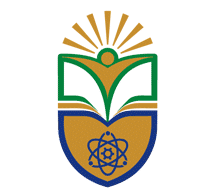
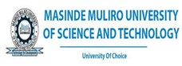
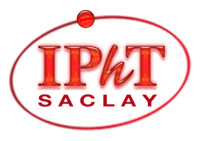
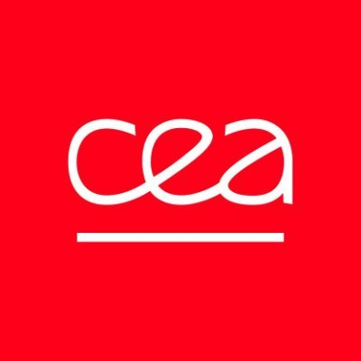

# The 2nd African STACK Conference for Undergraduate Mathematics

The 2nd African STACK Conference for Undergraduate Mathematics will took place on 12th - 16th August 2024 at The Technical University of Kenya (TUK), Kenya. The conference aimed to bridge the gap between educators with experience and access to STACK resources and the pressing need for support in teaching and formative assessment in the continent. It also aimed to open avenues for collaboration with international partners in research and evaluation, particularly on the effectiveness of digital interventions in assessment in low-resource environments.

... TODO! ...

## Supported by

   

      

         
 
         <h4>Technical University of Kenya</h4>

      

      

         
 
         <h4>Maseno University</h4>

      

      

         
 
         <h4>Kenya Mathematical Society</h4>

      

   

    
   

      

         
 
         <h4>IDEMS International</h4>

      

      

         
 
         <h4>INNODEMS</h4>

      

      

         
 
         <h4>SAMI</h4>

      

   

   

      

         
 
         <h4>MMUST</h4>

      

      

         
 
         <h4>European Research Council</h4>

      

      

         
 
         <h4>Institut de Physique Theorique</h4>

      

   

   

      

         
 
         <h4>Centre National de la Recherche Scientifique</h4>

      

      

         
 
         <h4>Centre d’Energie Atomique</h4>

      

   

 